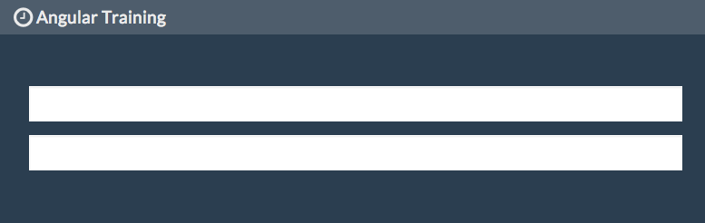

# Lab Two - Angular Basics

## Checkout the Lab Branch
- In a console:

```
git checkout lab-2-angular
git pull
```
&nbsp;
## Create index.html

- Open **client/assets/html/index.html**
- This is the initial page that is served to our users when they first visit our application.
- It also serves as the container for our **AngularJS** application.


- Let's review this together:
  - First notice that the design team has laid out the application with a *Bootstrap* navbar and a main content section.


- Register the application with Angular by adding the `ng-app` directive is in the `<html>` tag.
    - This tells Angular to boot itself up.


```xml
<html ng-app="main" class="no-js">
```

- Set the **MainCtrl** as the outermost controller for our application by adding the `ng-controller` directive to the body tag.

```xml
<body ng-controller="MainCtrl">
```

- Now we need a place for Angular to place our application templates.
- Find the todo and and the `ng-view` directive inside our DOM.

```xml
<div ng-view></div>
```

&nbsp;
## Create Main.js

- The `ng-app` directive that we just added specifies that the application module is named 'main'.
- Let's create that main module now.
- Open **client/src/main.js**


- Add the below code which will:
  - Register the `main` module.
  - Add the compiled templates from our `Grunt` build as dependencies.
  - Add the `app` module as a dependency. (We'll create that in a minute)
  - Use the `$log` service to notify us that the application is running via the browser's javascript console.

> Angular uses the '$' in front of all of its services to designate that it is part of the Angular library.

```javascript
angular.module('main', [
  'templates-main',
  'templates-lib',
  'app'
])

.run(function ($log) {
  $log.info("Application running.");
});
```

&nbsp;
## Create Application Controllers

- Now we need to create our application's controllers.
- Open **client/src/app/controllers.js**

- Add the below code to register the `app.controllers` module and create our controllers:

```javascript
angular.module('app.controllers', [])

  .controller('MainCtrl', function ($scope) {

  })

  .controller('AppCtrl',
    function ($scope){
      $scope.demo = {};
    }
  )

  .controller('NavCtrl',
    function ($scope) {

    }
  );
```

&nbsp;
## Run the Application
- Run the application via :

```
grunt serve:development
```
- Leave this console open and running. It is acting as your server to serve the `index.html` and its dependencies.


- Open a **NEW** console window and run:

```
grunt watch:development
```


- Navigate to http://localhost:3000/#/home
- What do you see? Is is similar to below?



- Try typing in either of the input boxes.


- Do you wonder how that is happening?
  - Open **client/assets/templates/index.html** and look at the model binding in the template.
  - You'll have many more chances to take advantage of this during the next few days.

### Commit your changes to Git
```
git add .
git commit -m 'First Angular app completed..huzzah'
```

### Congratulations on creating your first Angular application. You are now ready to take on the world!!
- Too much?
