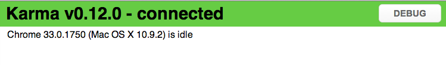
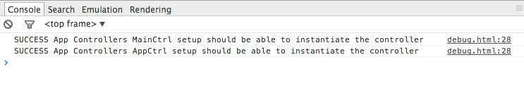
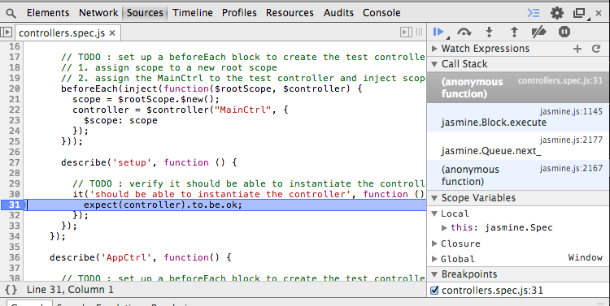

# Lab Three - Unit Testing with Karma

&nbsp;
## Checkout the Lab Branch
- In a console:

```
git checkout lab-3-karma
git pull
```
&nbsp;
## Karma Configuration

- We need to set up our `karma` configuration so that we can unit test our code as we write it.
- Open **karma.config.js**
- Most of the configuration has been started for you by your teammates, we just have a couple more configurations needed:

### Add the Jasmine framework

- Locate the `TODO` near line #4 and add the `jasmine` framework :

```javascript
frameworks: ['jasmine'],
```
- This instructs **karma** to use the Jasmine testing framework to run our tests.

### Configure Chrome

- We want `karma` to run our tests through the Chrome browser so that we have access to dev tools while running our tests.
- Find the `TODO` located near line #29 and register the Chrome browser via :

```javascript
browsers: ['Chrome'],
```

- Now that we have `karma` configured, we need to set up the Grunt task to run it during our build process.

&nbsp;
## Karma Grunt Task

- Now let's configure the `grunt-karma-runner` to run our tests.
- Open **Gruntfile.js**
- Your teammates have been so kind as to handle some work up front for you:
  - Set the NPM package for the `Grunt` task as dependency in `package.json`.
  - Imported the task into your `Grunt` configuration so that it is available.


- Locate the `TODO` near line #370 and configure the task:

```javascript
karma : {
  unit : {
    reporters: 'dots',
    configFile: 'karma.config.js'
  }
}
```
- Now, open a console and try running:

```
grunt karma:unit
```

- What does the output say? Did it have any tests to run?

```javascript
Running "karma:unit" (karma) task
INFO [karma]: Karma v0.12.0 server started at http://localhost:9876/
INFO [launcher]: Starting browser Chrome
INFO [Chrome 33.0.1750 (Mac OS X 10.9.2)]: Connected on socket riJgfDa7iGPHvrlcmPhH with id 52138247
Chrome 33.0.1750 (Mac OS X 10.9.2): Executed 0 of 0 ERROR (0.019 secs / 0 secs)
```

- Now that we have `karma` up and running, let's write some tests!

&nbsp;
> Leave `karma` running in the console!!
- This task will run in the background and run the tests for you automatically when you make changes to your source files.

&nbsp;
## Writing Your First Tests

- We're going to write a couple of tests to verify that we can instantiate the application's main controllers.
- First open **client/src/app/controllers.js** and look over its controllers.
   - Not much going on here yet, so we just need to test that we can instantiate the controllers.


- Open **client/test/unit/app/controllers.spec.js**.

###### Test the MainCtrl
- Locate the `TODO` near line #9 and replace it with the mock module instantiation:

```javascript
beforeEach(
 module(
   'app.controllers'
 ));
```
- This sets up our `app.controllers` module and gets it ready for testing.


- Next follow the instructions from the `TODO` near line 14 and add:

```javascript
beforeEach(inject(function($rootScope, $controller) {
  scope = $rootScope.$new();
  controller = $controller("MainCtrl", {
    $scope: scope
  });
}));
```

- What did we just do?
  - The beforeEach tells Jasmine to run the inclosed function before every test within the enclosing `describe`.
  - We then call `inject`, which instructs Angular that we are needing dependencies injected.
  - We inject the `$rootScope` and use it to construct a new `$scope` object for our test controller.
  - Using the `$controller` service, we instantiate a `MainCtrl` and inject our newly created `$scope` into it.


 - Find the `TODO` near line #20 and write your first test:

```javascript
describe('setup', function () {
  it('should be able to instantiate the controller', function () {
    expect(controller).to.be.ok;
  });
});
```
- So what did we do here?
  - In our test, we verify that we can actually create an instance of "MainCtrl"
  - By using `chai` matchers, we verify that our `controller` is defined and no error was thrown.


- The rest of our controller tests will use the same pattern.

- Did you notice that `karma` automatically ran your tests when you saved?

&nbsp;
> If you have any test failures at this point, go back and troubleshoot the previous specs.

&nbsp;
###### Test the AppCtrl

- Find the `TODO` near line #30 and set up the controller for testing:

```javascript
beforeEach(inject(function($rootScope, $controller) {
  scope = $rootScope.$new();
  controller = $controller("AppCtrl", {
    $scope: scope
  });
}));
```

- Now test the controller can be instantiated by replacing the `TODO` near line 38 with:

```javascript
it('should be able to instantiate the controller', function () {
	expect(controller).to.be.ok;
});
```

- Check that your tests are still all passing!


### Verify All Tests are Passing
- Are all of the tests still passing? Any failures? If not, let's keep moving!!

### Investigate Debug Mode in Chrome

###### Chrome Debug Mode
- Open the Chrome browser that is currently being controlled by `karma` and click the `Debug` button.



- This should open a **new** tab that you can use to debug your tests.
- Open Chrome dev tools with `ctrl-shift-i` or `cmd-option-i`
- Open the javascript console and refresh the page.
- You can see that `karma` is running your unit tests right in the browser.




###### Debug your tests
- Now open the `Sources` tab and open your `controllers.spec.js`.
- Place a break point in your first test, right at the line : `expect(controller).to.be.ok;`.



- Refresh the browser again.
- Notice how the test execution stops at that line of code.
- This becomes very handy when we start implementing more complicated tests and is a good tool to keep in your belt.

### Stop all consoles with `ctrl-c` and get ready for the next labs.

### Commit your work to Git

```
git add .
git commit -m 'Karma is set up and ready to go!'
```
