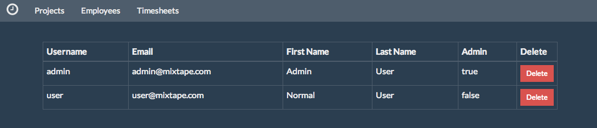
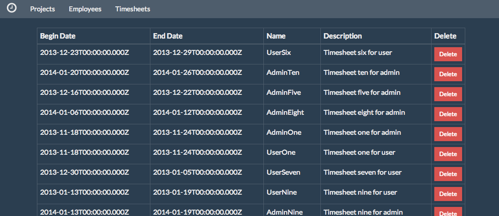

# Lab Four - Modules, Routing, and Resources

## Checkout the Lab Branch
- In a console:

```
git checkout lab-4-modules
git pull
```
&nbsp;
## Resources via `$resource`

- For this lab, we will be using the `api` and `data` services that were written with loving care for you by your teammates.
- These services use the `$resource` service from the `ngResource` Angular module, but provide you with a simple syntax to declare your resources and API routes.
- As an example, we will be registering an `employees` resource later in this lab.

###### api service
- Using the `api` service, the syntax would be:

```javascript
api.add({
  resource: 'employees',
  url: '/users'
});
```
- This registration automatically give you:
  - a POST to `/users` with a JSON request body via `data.create()`.
  - a GET to `/users` with parameters via `data.list()`
  - a GET to `/users` with a JSON request body (used for pagination) via `data.page()`.
  - a GET to `/users/:_id` via `data.get()`.
  - a PUT to `/users/:_id` with a JSON request body via `data.update()`
  - a PUT to `/users/:_id` with the model's deleted flag set to `true` via `data.restore()`
  - a PUT to `/users/:_id` with the model's deleted flag set to `false` via `data.restore()`


- Not bad for 4 lines of code, amiright?
- There are also ways to configure your resource for corner cases, but we will address that when needed in later labs.

###### data service

- The second service supplied by your teammates is the `data` service.
- This is a service that provides you with convenience methods to send requests to your server according to your `api` configurations.
- All of `data`'s methods return promises so that they can be handled consistently throughout the application.
- Each `data` service method expects up to 2 parameters:
  - The name of the resource
  - Either the model object or a query object (depending on the request type).


- For example to request a list of the employees resource:

```javascript
data.list('employees');
```
- This returns a promise that will return an array of objects when resolved.

&nbsp;
## Run the Server, Watch and Karma Tasks
- Before we get started, we always want to have our `watch` task running in the background.
  - This will run `JSHint` for us (amongst other things) which checks for issues that are known to cause errors.
  - Since this is a long running task, it needs to run in its own console window.

```
grunt watch:development
```

- We also want to have `karma` running in the background so that it will run our tests when our source files change and give us immediate feedback:

```
grunt karma:unit
```

&nbsp;
## Application Routing

- The first item we need to set up for our application is our routing to different areas of the application.
- Since AngularJS applications are SPA's (Single Page Applications), Angular provides us with the `$routeProvider` service to handle navigation.
  - The main responsibility of the `$routeProvider` service is to match a url with a controller and template.

- Let's register some routes with their respective controllers and templates.
- Open **client/src/app/app.js**
- In the config block, replace the `TODO` with the below code:

```javascript
$routeProvider
  .when('/projects', {
     templateUrl: 'assets/templates/app/projects/index.html',
     controller: 'ProjectCtrl'
   })
   .when('/employees', {
     templateUrl: 'assets/templates/app/employees/index.html',
     controller: 'EmployeeCtrl'
   })
   .when('/timesheets', {
     templateUrl: 'assets/templates/app/timesheets/index.html',
     controller: 'TimesheetCtrl'
   })
   .otherwise({
     redirectTo: '/projects'
   });
```
- Did you notice the `otherwise()` registered at the end?
- This tells the `$routeProvider` that if it is unable to match a url, to navigate to the `/projects` route as a default.

### Adding the links to our ***index.html***

- Now we need to add our menu buttons that link to the routes we just created.
- Open **client/assets/html/index.html**
- Find the `TODO` and add the below `<li>`'s that use the `ng-href` directive to link to our registered routes.

```xml
<li><a ng-href="/#/projects">Projects</a></li>
<li><a ng-href="/#/employees">Employees</a></li>
<li><a ng-href="/#/timesheets">Timesheets</a></li>
```

&nbsp;
### Let's start writing some controllers and templates so that we can see our app!!

> The Project Module has already been implemented for you. Please feel free to use it as a reference if you get stuck.

&nbsp;
## Employees Module

###### Employees resource

- Our first resource will be the `employees` resource.

- The server team has provided us with the REST endpoints that follow the application's standards.
  - The only caviat is that the url for employees is actually `/users`.
  - Not a problem though because we can set this configuration:


- Open **client/src/app/employees/employees.js**
- Locate the `TODO` to register the resource and add:

```javascript
api.add({
  resource: 'employees',
  url: '/users'
});
```

- Now we have a fully functioning resource that can query and update our server.
- To see it at work, let's create our controller.

###### Employee controller

- Open **client/src/app/employees/controllers.js**
- Inside the controller declaration replace the `TODO`'s with the following code:

```javascript
$scope.requestEmployees = function requestEmployees (page) {
  data.list('employees')
    .then(function (employees) {
      $scope.employees = employees;
    });
};

$scope.remove = function remove (employee) {
  data.remove('employees', employee)
    .then(function () {
      console.log('success!');
    })
    .catch(function (x) {
      employee.deleted = false;
      console.log('error : ' + x);
    });
};

$scope.restore = function restore (employee) {  
  data.restore('employees', employee)
    .then(function (restored) {
      console.log('success!');
    })
    .catch(function (x) {
      employee.deleted = true;
      console.log('error : ' + x);
    });
};

$scope.requestEmployees(1);
```

- What have we created here?
  - A `requestEmployees` function and added it to the controller's scope.
    - This function calls the `list()` function of the `data` service for the `employees` resource.
    - The result of the list is then assigned to the `employees` variable on `$scope`.
  - A `remove` function on `$scope` that takes an `employee` object as a param.
    - This function calls the `remove` function of the `data` service and logs to the console upon success.
    - If there is an error, it sets the deleted flag on the employee back to false and logs the error.
  - A `restore` function on `$scope` that in turn calls the `restore()` function of the `data` service.
    - If the restore is a success, we log it to console.
    - If there is an error, we reset the employee's deleted flag back to true and log the error.


- The final line of code calls `$scope.requestEmployees(1)` to initialize the list of employees when the controller is initialized.

### Test Our Employee Controller

- Now that we have our controller created, we need to test its behavior to make sure it acts as expected.
- To do this, we'll use the testing framework we set up in lab 3.

- Open **client/test/unit/app/employees/controllers.spec.js**

###### Set up a response for getting a list of users
- Since these are unit tests, we don't want to actually make real requests to the server when testing our controller methods.
- Angular provides us with the `$httpBackend` mock service so that we can intercept calls to the server, track them, and set up responses that we can use in our tests.

- Locate the `TODO` near line #58 and tell the `$httpBackend` service how to respond to a request for a list of users:

```javascript
$httpBackend.when('GET', '/users').respond(200, [{username: 'testUser'}]);
```

- Now that we know exactly what will be in our response, we can use it in our test specs.

###### Test the controller's instantiation
- Locate the `TODO` near line #62.
- Add a test to make sure we can create a new controller and it requests a list of employees

```javascript
it('should be able to instantiate the controller and request a list of employees', function () {
  expect(controller).to.be.ok;
  $httpBackend.expect('GET', '/users');
  $httpBackend.flush();
});
```

- We used a couple of different methods on the `$httpBackend` service:
  - `expect()` : This function tells the `$httpBackend` service to fail the test if the expected request is not made.
  - `flush()` : Since `$httpBackend` is not making real request to the server, it stores all of the requests that are made and will only evaluate the `expect()`'s  and return configured resonses once we call `flush()`.
    - This gives us real control of when we're testing our response expectations.

###### Test that employees is populated on scope

- Locate the `TODO` near line #71 and replace it a test that :
  - Sets an expectation on the `$httpBackend` service for a GET request to ***/users***.
  - Calls `$scope.requestEmployees()`
  - Flushes the `$httpBackend` service
  - Tests that the result of the requesting employees is set on the controller's `$scope` object.

```javascript
it('should set the result to the employees', function () {
  $httpBackend.expect('GET', '/users');
  $scope.requestEmployees();
  $httpBackend.flush();
  expect($scope.employees[0].username).to.equal("testUser");
});
```

###### Test removing an employee sends a PUT request

- Locate the `TODO` near line #82 and replace it a test that :
  - Flushes the `$httpBackend` service immediately so that the original request to get the employee list doesn't corrupt our test.
  - Sets an expectation of a PUT request to the url for the `employee` test object.
    - Respond with a `200` status.
  - Calls `$scope.remove(employee)`
  - Flush the http backend.

```javascript
it('should send a remove request for the specified employee', function () {
  $httpBackend.flush();
  $httpBackend.expect('PUT', '/users/' + employee._id).respond(200);
  $scope.remove(employee);
  $httpBackend.flush();
});
```
- Did you notice that we set an expectation on PUT?

###### Set a response for a successful remove request

- Locate the `TODO` near line #92 and set the response to:

```javascript
$httpBackend.when('PUT', '/users/' + employee._id).respond(200);
```

###### Test the behavior of a calling `$scope.remove()`

- Near line #95, replace the `TODO` with the following test:
  - Call the remove function on `$scope`.
  - Flush the mock http backend.
  - Test that the `deleted` flag is set to true on the `employee`.

```javascript
it('should set the employee to deleted for the ui', function () {
  $scope.remove(employee);
  $httpBackend.flush();
  expect(employee.deleted).to.be.true;
});
```

###### Set a response for a remove request with an error

- Locate the `TODO` near line #105 and set the response:

```javascript
$httpBackend.when('PUT', '/users/' + employee._id).respond(500);
```

###### Test the remove request that has errors

- Find the `TODO` near line #108 and replace it with a test that:
  - Calls the remove function on scope.
  - Flushes the backend and tests that the `employee.deleted` flag was not set to `true`.

```javascript
it('should set deleted to false for the employee in the ui', function () {
  $scope.remove(employee);
  $httpBackend.flush();
  expect(employee.deleted).to.be.false;
});
```

###### Test restoring an employee sends a PUT request

- Locate the `TODO` near line #122 and replace it with a test that:
  - Flushes the backend immediately to clear the `$httpBackend` service.
  - Sets an expectation for a PUT request to the url corresponding to the `employee` object.
    - Respond with a status of `200`.
  - Calls the `restore()` function on scope and passes in the `employee`.
  - Flushes the backend in order to run expectations.

```javascript
it('should send a restore request for the specified employee', function () {
  $httpBackend.flush();
  $httpBackend.expect('PUT', '/users/' + employee._id).respond(200);
  $scope.restore(employee);
  $httpBackend.flush();
});
```

###### Test restoring an employee with success

- Locate the `TODO` near line #132 and configure a successful response:

```javascript
$httpBackend.when('PUT', '/users/' + employee._id).respond(200);
```
- Now locate the `TODO` near line #135 and test that the employee is restored:
  - Call the `restore` function on scope
  - Flush the http backend service.
  - Test that the `employee.deleted` flag was set to `false`.

```javascript
it('should set the employee to not deleted for the ui', function () {
  $scope.restore(employee);
  $httpBackend.flush();
  expect(employee.deleted).to.be.false;
});
```

###### Test restoring an employee that results in an error

- Locate the `TODO` near line #145 and set an error response for a restore request:

```javascript
$httpBackend.when('PUT', '/users/' + employee._id).respond(500);
```

- Next, find the `TODO` near line #148 and test the error:
  - Call the `restore()` function on scope.
  - Flush the http backend.
  - Test that the `employee.deleted` flag was set to `true`.

```javascript
it('should set deleted to true for the employee in the ui', function () {
   $scope.restore(employee);
   $httpBackend.flush();
   expect(employee.deleted).to.be.true;
});
```

### Check the Tests
- Have you been watching as `karma` ran each of your tests when you saved the file? Pretty cool, huh?
- Are all your tests passing? If not, see if you can troubleshoot your issues and get to green.
- You should have output similar to:

```
Chrome 33.0.1750 (Mac OS X 10.9.2): Executed 19 of 19 SUCCESS (0.127 secs / 0.121 secs)
```

&nbsp;
### Create Employee Views

- Now that we have our employee resources and controllers created and tested, it's time to instruct our templates on how to behave.

###### Employee list view

- Open **client/assets/templates/app/employees/index.html**
- This is our list page for our employees module.
- You'll notice that the design team has already set up the layout of the page, we just need to add the functionality to display the employee list and react to actions.


- Let's first set up a `ng-repeat` directive to loop through our `$scope.employees` array that gets set up in our `requestEmployees()` controller function.
  - As Angular is iterating through our array, it assigns a variable, `employee` on scope for any of the child elements or `<td>`'s in this case.
  - We can then use the `employee` variable to bind to its properties.


- Locate the `TODO` near line #22 and add the following to the `<tr>` tag:

```xml
<tr ng-repeat="employee in employees"
    class="fadeable-row"
    ng-class="{faded: employee.deleted}">
```

- You'll notice that we've also added a `ng-class` directive that takes a javascript object as a parameter.
  - This asks Angular to interpret the value of `employee.deleted`.
  - If it is `true` (or truthy), the class, `faded` will be added to the `<tr>`.


- Now we need to bind the data of the `employee` to the table's data cells.
- Find the `TODO` near line #26 and add the data bindings to the `<td>`'s.

```xml
<td>{{employee.username}}</td>
<td>{{employee.email}}</td>
<td>{{employee.firstName}}</td>
<td>{{employee.lastName}}</td>
<td>{{employee.admin}}</td>
```
- For the last `<td>`, we want to display a button that changes its behavior and text based upon the `employee.deleted` flag.
  - If the employee is deleted, we want to show the 'Restore' button that calls the controller's `restore()` method.
  - If the employee is not deleted, we want to show the 'Delete' button that calls the controller's `remove()` method.


- To do this find the `TODO` located near line #32 and insert the below code in the `<td>`:

```xml
<div ng-switch="employee.deleted">
  <div ng-switch-when="true">
    <button class="btn btn-sm btn-default" ng-click="restore(employee); $event.stopPropagation();">Restore</button>
  </div>
  <div ng-switch-default>
    <button class="btn btn-sm btn-danger" ng-click="remove(employee); $event.stopPropagation();">Delete</button>
  </div>
</div>
```
- Wow, that's a lot of new stuff. Let's look at what we did.

- In our outer `<div>`, we added the `ng-switch` directive that evaluates `employee.deleted`.


- Within the `ng-switch` directive, we have two tests: `ng-switch-when="true"` and `ng-switch-default`.
  - The `ng-switch-when` tells Angular to only show the Restore button if `employee.deleted` is "true".
  - The `ng-switch-default` tells Angular to show the Delete button when no other `ng-switch-when` resolves to truthy.


- We have also added a `ng-click` directive to each of the buttons.
  - This directive tells Angular what to do when the element is clicked.
  - We are also using Angular's `$event` service, which captures the event, and telling it to not let the click event bubble up to surrounding DOM elements.

### Run the Application
- It's time to run the application and view your hard work!!
- If you haven't already, start the application via:

```
export NODE_ENV="development";node ./api/server.js
```

- Open your Chrome browser and navigate to http://localhost:3000/#/employees

- Do you see your table of employees?




- Can you delete and restore them? Does the CSS change when you do?

- Well now that you are all experts, let's implement the Timesheets module!!

&nbsp;
## Timesheets Module

- Since you've already done this, this module should be easy, right?

### Configure the Timesheet Resource

- Open **client/src/app/timesheets/timesheets.js** and configure the resource:

```javascript
api.add({
  resource: 'timesheets',
  url: '/users/:user_id/timesheets',
  params: {
    user_id: '@user_id'
  }
});
```

- Wait a minute, what is the extra `params` configuration to this resource?
- If you notice, the url requires an additional `user_id` path variable because our server API needs that information.
- The `params` config object lets `$resource` know to get that variable from the query object and create our url with it.

### Implement the Timesheet Controller

- Open **client/src/app/timesheets/controllers.js**
- Implement the timesheet controller, by following the instructions in the `TODO`'s.
- The code below is here to help you if you get stuck, but try to do it yourself first.
- Don't forget that you have the other modules to use as a reference!!


- (near line #11)

```javascript
data.list('timesheets', query)
 .then(function (timesheets) {
   $scope.timesheets = timesheets;
 });
```

- (near line #17)

```javascript
$scope.remove = function remove (timesheet) {
  data.remove('timesheets', timesheet)
    .then(function () {
      console.log('success !');
    })
    .catch(function (x) {  
      timesheet.deleted = false;
      console.log('error ' + x);
    });
};

$scope.restore = function restore (timesheet) {
  data.restore('timesheets', timesheet)
    .then(function (restored) {
      console.log('success !');
    })
    .catch(function (x) {
      timesheet.deleted = true;
      console.log('error ' + x);
    });
};

$scope.requestTimesheets(1);
```

### Test the Timesheet Controller

- Once again, now that we have the controller implemented, it's time to test its behavior:

- Open **client/test/unit/app/timesheets/controllers.spec.js**
- Follow the instructions in each of the `TODO`'s to test your controller.
- If you get stuck, use the **project** or **employee** modules to help you.

&nbsp;
###### Once again, the code below is here to help if you need it.
- (near line #68)

```javascript
$httpBackend.when('GET', '/users/all/timesheets').respond(200, [{name: 'testTimesheet'}]);
```

- (near line #72)

```javascript
it('should be able to instantiate the controller and request a page of timesheets', function () {
  expect(controller).to.be.ok;
  $httpBackend.expect('GET', '/users/all/timesheets');
  $httpBackend.flush();
});
```

- (near line #81)

```javascript
it('should set the result to the timesheets', function () {
  $httpBackend.expect('GET', '/users/all/timesheets');
  $scope.requestTimesheets();
  $httpBackend.flush();
  expect($scope.timesheets[0].name).to.equal("testTimesheet");
});
```

- (near line #91)

```javascript
it('should send a remove request for the specified timesheet', function () {
  $httpBackend.flush();
  $httpBackend.expect('PUT', '/users/1234567890/timesheets/' + timesheet._id).respond(200);
  $scope.remove(timesheet);
  $httpBackend.flush();
});
```

- (near line #101)

```javascript
$httpBackend.when('PUT', '/users/1234567890/timesheets/' + timesheet._id).respond(200);
```

- (near line #104)

```javascript
it('should set the timesheet to deleted for the ui', function () {
  $scope.remove(timesheet);
  $httpBackend.flush();
  expect(timesheet.deleted).to.be.true;
});
```

- (near line #114)

```javascript
$httpBackend.when('PUT', '/users/1234567890/timesheets/' + timesheet._id).respond(500);
```

- (near line #117)

```javascript
it('should set deleted to false for the timesheet in the ui', function () {
  $scope.remove(timesheet);
  $httpBackend.flush();
  expect(timesheet.deleted).to.be.false;
});
```

- (near line #131)

```javascript
it('should send a restore request for the specified timesheet', function () {
  $httpBackend.flush();
  $httpBackend.expect('PUT', '/users/1234567890/timesheets/' + timesheet._id).respond(200);
  $scope.restore(timesheet);
  $httpBackend.flush();
});
```

- (near line #141)

```javascript
$httpBackend.when('PUT', '/users/1234567890/timesheets/' + timesheet._id).respond(200);
```

- (near line #144)

```javascript
it('should set the timesheet to not deleted for the ui', function () {
  $scope.restore(timesheet);
  $httpBackend.flush();
  expect(timesheet.deleted).to.be.false;
});
```

- (near line #154)

```javascript
$httpBackend.when('PUT', '/users/1234567890/timesheets/' + timesheet._id).respond(500);
```

- (near line #157)

```javascript
it('should set deleted to true for the timesheet in the ui', function () {
  $scope.restore(timesheet);
  $httpBackend.flush();
  expect(timesheet.deleted).to.be.true;
});
```

### Timesheet View

- Open **client/assets/templates/app/timesheets/index.html**
- Follow the instructions listed in each `TODO` to configure your template to work like the others.
- Yes, the code is here too..but really..try to do it on your own first.

- (near line #16)

```xml
<tr ng-repeat="timesheet in timesheets"
  class="fadeable-row"
  ng-class="{faded: timesheet.deleted}">

  <td>{{timesheet.beginDate}}</td>
  <td>{{timesheet.endDate}}</td>
  <td>{{timesheet.name}}</td>
  <td>{{timesheet.description}}</td>
```

- (near line #25)

```xml
<div ng-switch="timesheet.deleted">
  <div ng-switch-when="true">
    <button class="btn btn-sm btn-default" ng-click="restore(timesheet); $event.stopPropagation();">Restore</button>
  </div>
  <div ng-switch-default>
      <button class="btn btn-sm btn-danger" ng-click="remove(timesheet); $event.stopPropagation();">Delete</button>
  </div>
</div>
```

### Run the Application
- Time to run or refresh the application again and see it in action.
- You have already mastered this, so I won't bore you with further instructions.
- Navigate to the **Timesheets** tab. Does it look similar to below?



### Commit your changes and get ready for the next lab!
```
git add .
git commit -m 'Modules and tests are complete'
```
