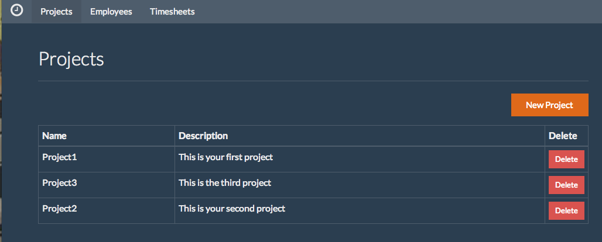
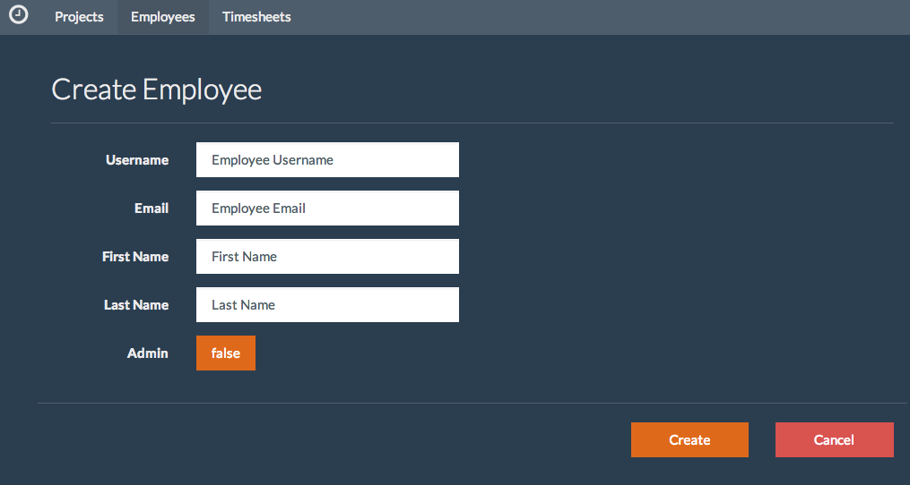
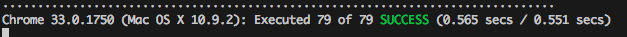
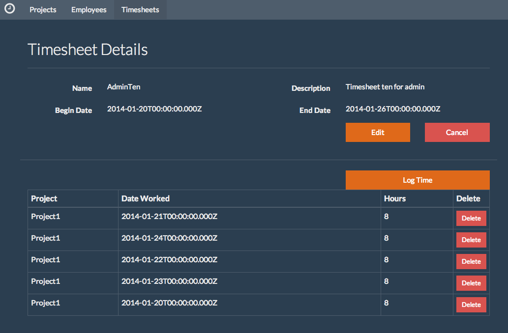

# Lab Five - Navigation with UI Router

&nbsp;
## Checkout the Lab Branch
- In your console:

```
git checkout lab-5-uirouter
git pull
```

&nbsp;
## Start the Grunt Tasks (Separate Consoles)
```
grunt karma:unit
```

```
grunt watch:development
```

```
export NODE_ENV="development";node ./api/server.js
```

&nbsp;
## Application States and Review

### Review main.js and state set up
- Before we get started let's see what our teammates have already done for us.
- Open **main.js** or just look below:

```javascript
.config(function ($urlRouterProvider) {
  $urlRouterProvider.otherwise("/app/projects");
})

.run(function ($log, $state, $rootScope, $stateParams) {
  // putting state into $rootScope so that these services are available in views
  $rootScope.$state = $state;
  $rootScope.$stateParams = $stateParams;

  $log.info("Application running.");
});
```
- What is happening here?
  - We are using the `$urlRouterProvider` to default any unmatched urls to */app/projects*
    - More on this url later.
  - In our main module's `run()` block, we are assigning the `$state` and `$stateParams` as properties on `$rootScope`.
    - This allows us to use these services in our views, without having to manually add them to scope in the controllers.

### Set up the named views for our application

- Now we need to set up our **index.html** to handle the multiple sections and states of our application.
- Open **client/assets/html/index.html**.
- Locate the `TODO` and add the 3 sections inside our `tsz-page-container` div.

```xml
<div ui-view="navbar"></div>
<div ui-view="content"></div>
<div ui-view="login"></div>
```

> This sets up sections to hold our navbar, application content, and the login form.

### Add the `ui-view` directive to our app index

- We now need to tell *UI Router* where to place the content of our states.
- Open **client/assets/templates/app/index.html**
- Locate the `TODO` near line #11 and add a `<div>` that calls the `ui-view` directive:

```xml
<div ui-view></div>
```
- Since we're here, let's also bind the section header to data from the current state.
- The `$state` service contains extra information that we can configure and recall via its `current` property.
- In this instance, we'll set the section header's text in our configuration so that our page headers can be dynamic.


- Locate the `TODO` near line #4 and add:

```xml
<h2>{{$state.current.data.section}}</h2>
```
- This is taking advantage of the fact that we've assigned `$state` to `$rootScope` and is binding to `section` in the state's data.

### Set up the application states

- Let's set up the 'root' state that is the parent state for all of our application states.
- The root state has the following requirements:
  - The name of the state is "app".
  - The url for the state is "/app".
  - The state cannot be transitioned to or is *abstract*
  - We need to set the title for the application in the state's *data* object.
  - The state has 2 views:
    - `navbar` : maps the *navbar.html* template to the *NavCtrl* controller.
    - `content` : maps the *index.html* template to the *AppCtrl" controller.
      - This is also where the main content of the application will be displayed.

- Open **client/src/app/app.js**.

- Locate the `TODO` near line #2 and add the UI Router module as a dependency:

```javascript
'ui.router',
```

- With that completed, we now can use the `$stateProvider` service.
- At the `TODO` near line #11 register the *app* state with the `$stateProvider`.

```javascript
.config(function ($stateProvider) {
  $stateProvider
    .state('app', {
      abstract: true,
      url: '/app',
      data: {
        title: 'The Timesheet App'
      },
      views : {
        'navbar' : {
          controller: 'NavCtrl',
          templateUrl: 'assets/templates/app/navbar.html'
        },
        'content' : {
          controller: 'AppCtrl',
          templateUrl: 'assets/templates/app/index.html'
        }
      }
    });
});
```
> Did you get an error? Remember the config() is chained off the module(). Is there something in the way..like a semi-colon?

###### Run the application and see your work
- With everything in place, it's time to reap the fruits of our labor.
- Verify that your server is still running in the console.
- Open a browser to http://localhost:3000
- Were you immediately redirected to the `app.projects` state?
- You'll notice that the *Project* module has been implemented for you, so you can reference it during the next labs if you get stuck.



- With that under our belt, implementing the `employees` states and controllers should be a piece of cake, right?

&nbsp;
## Employees States

- Time to add the implementation for our employee states.

###### Register the Employee states
- Open **client/src/app/employees/employees.js**

- Starting at the `TODO` near line #6, add:

```javascript
.config(function ($stateProvider) {

  $stateProvider
    .state('app.employees', {
      url: '/employees',
      controller: 'EmployeeCtrl',
      templateUrl: 'assets/templates/app/employees/index.html',
      data: {
        section: 'Employees'
      }
    })

    .state('app.employees.detail', {
      url: '/detail/:_id',
      controller: 'EmployeeDetailCtrl',
      templateUrl: 'assets/templates/app/employees/form.html',
      data: {
        section: 'Update Employee',
        saveText: 'Update'
      },
      resolve : {
        employee : [
          'data',
          '$stateParams',
          function (data, $stateParams) {
            return data.get('employees', $stateParams);
          }]
      }
    })

    .state('app.employees.create', {
      url: '/create',
      controller: 'EmployeeCreateCtrl',
      templateUrl: 'assets/templates/app/employees/form.html',
      data: {
        section: 'Create Employee',
        saveText: 'Create'
      }
    });
})
```

- What did we just do?

  - We added a child state to our `app` state and called it : `app.employees`.
    - The state matches the `/employees` url to the `EmployeeCtrl` controller and `index.html` in the employees templates folder.
    - We also set the `section` to 'Employees', so `$state.current.data.section` will be **Employees** whenever we are within this state.
  - We added 2 child states to the `app.employees` state : `detail` and `create`.
    - Each of these child states set a different `section` on the state's data configuration object.
    - Each state also sets a `saveText` property on data. (More on this later)
  - One last point of interest is in the configuration for `app.employees.detail`'s **resolve** block:
    - We set an `employee` object to be injected into the state's controller by assigning it the result of `data.get('employees', $stateParams);`
    - The `$state` service will not resolve this state until our server has responded.


- Look for other `TODO`'s in the page and follow their instructions. (hint : look a the top)

&nbsp;
### EmployeeCtrl

###### Implement the employee controllers

- Just like in Projects, we need to implement similar functionality in our employee controllers.

- Open **client/src/app/employees/controllers.js**

##### First things first: Find the related `TODO`'s and inject `$state` and `$stateParams` into all 3 of our controllers.

```javascript
function ($scope, data, $state, $stateParams) {
```

##### Now let's implement some functionality

- At the `TODO` near line #14, add the `showDetail` and `createNew` methods:
- The `showDetail` function will react to a user clicking on an employee in the table:
- We need to make sure that the employee is not deleted and then instruct the `$state` service to go to the `app.employees.detail` state.

```javascript
$scope.showDetail = function showDetail (employee) {
  if (employee.deleted) {
     console.log('cannot view a deleted employee');
     return;
  }
  $state.go('app.employees.detail', employee);
};
```
- The `createNew` function will react to a user clicking the create new button on our list page.
- We just need to instruct the `$state` service to transition to the `app.employees.create` state.

```javascript
$scope.createNew = function createNew () {
  $state.go('app.employees.create', $stateParams);
};
```

- Add the `cancel` function by replacing the `TODO` near line #50 with:

```javascript
$scope.cancel = function cancel () {
  $state.go('app.employees', {}, {reload: true});
};
```
&nbsp;
### EmployeeDetailCtrl

###### Set `saveText`

- We first need to set the `saveText` property on the controller's scope object to be the current state's `saveText`.
- Locate the `TODO` and add:

```javascript
$scope.saveText = $state.current.data.saveText;
```

###### Updating an employee
- To update an employee, we can use the instance method, `$update` on our `$resource` object.
- This method returns a promise that we need to set success and error handlers for:
  - If the response is successful, update `$scope.timesheet` with the response object.
  - If the response errors, log the error to the console (for now).


- Locate the `TODO` near line #63 and add:

```javascript
$scope.save = function save () {
  $scope.employee.$update()
    .then(function (updated) {
      $scope.timesheet = updated;
      console.log('success!');
    })
    .catch(function (x) {
      console.log('error : ' + x);
    });
};
```
&nbsp;
### EmployeeCreateCtrl

###### Set `saveText`

- Just like in the `EmployeeDetailCtrl` set the `saveText` on `$scope` to the current state's data:

```javascript
$scope.saveText = $state.current.data.saveText;
```

###### Employee create controller
- Add the saving of a newly created employee.
  - For this we will use the `create()` method in our `data` service.
    - Pass in the employee in scope as the second argument.
  - If the response is a success, instruct the `$state` service to go to the employee's detail.
  - If there is an error, log it to the console.

- Find the `TODO` near line #81 and add:

```javascript
$scope.save = function save () {
  data.create('employees', $scope.employee)
    .then(function (created) {
      console.log('success!');
      $state.go('app.employees.detail', {_id: created._id});
    })
    .catch(function (x) {
      console.log('error : ' + x);
    });
};
```
- Are you beginning to notice any patterns?

&nbsp;
### Unit test the Controllers

- Now that we have implemented our employee controllers, let's test the behavior!
- Open **client/test/unit/app/employees/controllers.spec.js**

###### Test setup
- In order for our Jasmine tests to know about ui-router, you'll need to inject the `$state` and `$stateParams` services into your mock module:
- Locate the `TODO` near line #25 and inject the two services into our `beforeEach` block:

```javascript
beforeEach(inject(function (_$rootScope_, _$httpBackend_, _$controller_, _$state_, _$stateParams_){
  $rootScope = _$rootScope_;
  $httpBackend = _$httpBackend_;
  $controller = _$controller_;
  $state = _$state_;
  $stateParams = _$stateParams_;
}));
```
- Since we want to test that `$state` is being called, not actually transition to the different states, we will use the `sinon` library to stub out the behaviour.
- Stub the `$state` service by replacing the `TODO` near line #37 with:

```javascript
state: sinon.stub($state)
```
- Now `sinon` will track all of our interactions with the `$state` service and make that information available to us in our tests.

&nbsp;
### EmployeeCtrl

###### Write the tests

- We want to make sure that our controller uses the stubbed `$state` service (and not the real one), so..


- Let's inject our stubbed services into our controller under test:
- Around line #62, replace the `TODO` with:

```javascript
$state: spies.state
```

- Test the detail transition by replacing the `TODO` near line #91 with:
  - Flushing the mock http backend to avoid any test corruption.
  - Call our new `showDetail(employee)` method on scope.
  - Test that the `$state.go()` function was called with the correct state name, `app.employees.detail`.

```javascript
it('should transition to the employee detail state', function () {
  $httpBackend.flush();
  $scope.showDetail(employee);
  expect(spies.state.go).to.have.been.calledWith('app.employees.detail');
});
```

- Test the create employee transition by replacing the `TODO` near line #98 with:
  - Flushing the backend first.
  - Call the `createNew()` function on scope.
  - Verify that the `$state.go()` was called with the correct state.

```javascript
it('should transition to the create employee state', function () {
  $httpBackend.flush();
  $scope.createNew();
  expect(spies.state.go).to.have.been.calledWith('app.employees.create');
});
```

- Test the cancel transition by replacing the `TODO` near line #183 with:
  - Flush the backend.
  - Call the `cancel()` function on scope.
  - Verify that the `$state.go()` function was called as expected.

```javascript
it('should return back to the employee list', function () {
  $httpBackend.flush();
  $scope.cancel();
  expect(spies.state.go).to.have.been.calledWith('app.employees');
});
```

&nbsp;
### EmployeeDetailCtrl

###### Test the employee detail controller

- We first need to set up the `data` configuration in our stubbed `$state` service.
- Locate the `TODO` near line #195 and set up the current state's data object:

```javascript
spies.state.current = {data: {saveText: 'update'}};
```

- Next, Let's inject our stubbed service into our controller under test:
- Replace the `TODO` with:

```javascript
$state: spies.state
```

- Test that `saveText` was added to scope from the current state's date by replacing the `TODO` near line #211 with:

```javascript
it('should set saveText to the current state saveText', function () {
  expect($scope.saveText).to.equal('update');
});
```

- Test the controller is initialized with the employee injected from the state's resolve by replacing the `TODO` near line 215 with:

```javascript
it('should set the employee on scope to the resolved employee', function () {
  expect($scope.employee._id).to.equal(employee._id);
  expect($scope.employee.username).to.equal(employee.username);
});
```

- Test an updated employee is saved to scope.
- Find the `TODO' near line #235 and replace it with:
  - Call the `save()` method on scope.
  - Flush the mock http backend.
  - Verify that `$scope.employee` matches our expected response.

```javascript
it('should set the employee on scope to be the updated employee', function () {
  $scope.save();
  $httpBackend.flush();
  expect($scope.employee.username).to.equal(updatedEmployee.username);
});
```
&nbsp;
### EmployeeCreateCtrl

###### Test the create employee controller

- Set the current state's data for testing.
- Near line #248 replace the `TODO` with:

```javascript
spies.state.current = {data: {saveText: 'create'}};
```

- Next, Let's inject our stubbed services into our controller under test:
- Replace the `TODO` with:

```javascript
$state: spies.state
```

- Test that the controller is initialized as expected.
- Replace the `TODO` near line #263 with:

```javascript
it('should set saveText to the current state saveText', function () {
  expect($scope.saveText).to.equal('create');
});

it('should set the employee on scope to a non admin user', function () {
  expect($scope.employee.admin).to.be.false;
  expect($scope.employee.username).to.be.empty;
});
```

- Test the save function:
  - Call the `$scope.save()` function.
  - Flush the mock http backend.
  - Verify that the `$state` service was instructed to go the newly created employoee's detail page.

```javascript
it('should transition to the detail page of the created employee', function () {
  $scope.save();
  $httpBackend.flush();
  expect(spies.state.go).to.have.been.calledWith('app.employees.detail', {_id: employee._id});
});
```

- If you haven't already, check your `karma` console and verify that all of your wonderful tests are passing.

### Add all the things to our views

- Now that we have our states configured and our controllers tested, let's add the functionality to our views so we can see what happens.

###### Navigation
- First let's add the ability to navigate to our employees states to the NavBar

- Open **client/assets/templates/app/navbar.html**
- Find the `TODO` near line #13 and add the `ng-class` and `ui-sref` directives to our markup.

```xml
<li ng-class="{active: $state.includes('app.employees')}">
  <a ui-sref="app.employees">Employees</a>
```
- What is this?
  - The `ng-class` directive sets a class on an element if the second part of the hash is truthy.
    - So if the current state is (or a child of) `app.employees`, the `<li>` will have a class of **enabled**.
  - The `ui-sref` directive is used to replace the `href` attribute, but takes a state name instead of a url.
    - When the user clicks this link, the `$state` service will transition to the `app.employees` state.


###### List View

- Open **client/assets/templates/app/employees/index.html**
- At the `TODO` near line #5, add the button to navigate to the create employee state:

```xml
<button class="btn btn-primary btn-block" type="button" ng-click="createNew()">
  <i class="icon-plus"></i>
  New Employee
</button>
```
- Follow the instructions provided by the remaining `TODO`'s to add `ng-click` and `ui-view` directives where needed.

###### Form View

- Open **client/assets/templates/app/employees/form.html**
- Follow the instructions provided by the `TODO`'s to add `ng-model` and `ng-click` directives where needed.

### Run the Application

- Now that the views are also implemented we can start the app and see our progress.
- Can you navigate between project and employee states?
- Can you create new projects and employees?
- Can you update existing projects?



- Only two more modules to go and we will have the basis for our application!!

&nbsp;
## Timesheets and Timeunits States

- It's officially time to implement our timesheet states and controllers.
- These next two modules will differ ever so slightly from the projects and employees modules, because these will be demonstrating UI Router's ability to nest states and use inheritance.

###### Register timesheet states
- First, let's register the timesheet states.
- Open **client/src/app/timesheets/timesheets.js**
- Locate the `TODO` and register:

```javascript
.config(function ($stateProvider) {
  $stateProvider
    .state('app.timesheets', {
      url: '/users/:user_id/timesheets',
      controller: 'TimesheetCtrl',
      templateUrl: 'assets/templates/app/timesheets/index.html',
      data: {
        section: 'Timesheets'
      }
    })
    .state('app.timesheets.detail', {
      url: '/detail/:_id',
      controller: 'TimesheetDetailCtrl',
      templateUrl: 'assets/templates/app/timesheets/detail.html',
      data: {
        section: 'Timesheet Details'
      },
      resolve : {
        timesheet : [
          'data',
          '$stateParams',
          function (data, $stateParams) {
            return data.get('timesheets', $stateParams);
          }
        ],
        timeunits : [
          'data',
          '$stateParams',
          function (data, $stateParams) {
            return data.list('timeunits', {timesheet_id: $stateParams._id, user_id: $stateParams.user_id});
          }
        ]
      }
    })
    .state('app.timesheets.detail.edit', {
      url: '/edit',
      controller: 'TimesheetEditCtrl',
      templateUrl: 'assets/templates/app/timesheets/form.html',
      data: {
        section: 'Edit Timesheet',
        saveText: 'Update'
      }
    })
    .state('app.timesheets.create', {
      url: '/create',
      controller: 'TimesheetCreateCtrl',
      templateUrl: 'assets/templates/app/timesheets/form.html',
      data: {
        section: 'Create Timesheet',
        saveText: 'Create'
      }
    });
})
```
- This should be all very familiar to you by now, but notice that in the `app.timesheets.detail` state's resolve, we are injecting both a `timesheet` and a list of `timeunits`.
- Take a minute to look over the configuration and determine which states marry which controllers to urls and templates.
- When you have a good understanding, continue to implementing the controllers.

&nbsp;
### TimesheetCtrl

###### Open the controller file

- Open **client/src/app/timesheets/controllers.js**

##### First things first: Find the related `TODO`'s and inject `$state` and `$stateParams` into all 4 of the Timesheet controllers.

- First we need a configuration to help us refine our timesheet search to specific employees. We'll revisit this in a later lab, but for now...
- Locate the `TODO` near line #8 and register the query object with the help of `$stateParams` service:

```javascript
var query = {
  user_id: $stateParams.user_id
};
```

- Implement the `showDetail` and `createNew` methods via the `TODO` near line #18:

```javascript
$scope.showDetail = function showDetail (timesheet) {
  if (timesheet.deleted) {
    console.log('error : cannot view a deleted timesheet');
    return;
  }
  $state.go('app.timesheets.detail', timesheet);
};

$scope.createNew = function createNew () {
  $state.go('app.timesheets.create', $stateParams);
};
```

&nbsp;
### TimesheetDetailCtrl

###### Timesheet detail controller

- The timesheet detail state is very different from any of our other application states:
  - It shows the detail of a specific timesheet
  - It also contains a table of timeunits that belong to the timesheet.
  - The user can also log addition timeunits on the timesheet.

- Add the additional methods needed by replacing the `TODO` near line #63:

- First, we need a method to react to the user clicking the `edit` button.
  - Instruct the `$state` service to transition to the `app.timesheets.detail.edit` state for the timesheet.

```javascript
$scope.edit = function edit (timesheet) {
  $state.go('app.timesheets.detail.edit', $stateParams);
};
```

- Next we need to handle clicking the `cancel` button.

```javascript
$scope.cancel = function cancel () {
  $state.go('app.timesheets', $stateParams, {reload: true});
};
```

- Since the page also includes a listing of the timesheet's timeunits, we need:
  - A handler on scope for when the user clicks the button to log time.

```javascript
$scope.logTime = function logTime () {
  $state.go('app.timesheets.detail.timeunits.create', $stateParams);
};
```
- We also need a handler for when a user clicks an individual timeunit.
  - This will behave similar to our other `showDetail()` functions for other modules.

```javascript
$scope.showTimeunitDetail = function showTimeunitDetail (timeunit) {
  if (timeunit.deleted) {
    console.log('error deleting timesheet');
    return;
  }

  $stateParams.timeunit_id = timeunit._id;
  $state.go('app.timesheets.detail.timeunits.edit', $stateParams);
};
```

&nbsp;
### TimesheetEditCtrl

###### Timesheet edit controller

- Locate the `TODO` near line #117 and set `saveText` to the current state's:

```javascript
$scope.saveText = $state.current.data.saveText;
```

- Add a save method to update an existing timesheet.
- Find the `TODO` around line #120 and replace it with:

```javascript
$scope.save = function save () {
  $scope.timesheet.$update()
    .then(function (updated) {
      $scope.timesheet = updated;
      console.log('success !');
    })
    .catch(function (x) {
      console.log('error ' + x);
    });
};
```

- Handle cancelling the form by replacing the `TODO` near line 131:

```javascript
$scope.cancel = function cancel () {
  $state.go('app.timesheets.detail', $stateParams, {reload: true});
};
```

&nbsp;
### TimesheetCreateCtrl

###### Create timesheet controller

- Locate the `TODO` and set `saveText` to the current state's:

```javascript
$scope.saveText = $state.current.data.saveText;
```

- Implement the required methods by replacing the `TODO` near line 142:

```javascript
$scope.save = function save () {
  var timesheet = angular.extend({user_id: $stateParams.user_id}, $scope.timesheet);

  data.create('timesheets', timesheet)
    .then(function (created) {
      $state.go('app.timesheets.detail', {user_id: $stateParams.user_id, _id: created._id});
      console.log('success !');
    })
    .catch(function (x) {
       console.log('error ' + x);
    });
};

$scope.cancel = function cancel () {
  $state.go('app.timesheets', $stateParams, {reload: true});
};
```

&nbsp;
> For the Timeunit module, I'll just provide you with the specifics.

&nbsp;
### Configure the Time Unit States

- Now let's configure the states for Timeunits.
- Open **client/src/app/timesheets/timeunits/timeunits.js**
- Configure the states by replacing the `TODO` near line #6 :

```javascript
.config(function ($stateProvider) {
  $stateProvider
    .state('app.timesheets.detail.timeunits', {
      abstract: true,
      url: '/timeunits',
      controller: 'TimeunitCtrl',
      template: '<div ui-view></div>',
      resolve: {
        projects: [
          'data',
          function (data) {
            return data.list('projects');
          }]
      }
    })
    .state('app.timesheets.detail.timeunits.create', {
      url: '/create',
      controller: 'TimeunitCreateCtrl',
      templateUrl: 'assets/templates/app/timesheets/timeunits/form.html',
      data: {
        section: 'Log Time'
      }
    })
    .state('app.timesheets.detail.timeunits.edit', {
      url: '/edit/:timeunit_id',
      controller: 'TimeunitEditCtrl',
      templateUrl: 'assets/templates/app/timesheets/timeunits/form.html',
      data: {
        section: 'Edit Time'
      },
      resolve : {
        timeunit : [
          'data',
          '$stateParams',
          function (data, $stateParams) {
            return data.get('timeunits', {_id: $stateParams.timeunit_id, user_id: $stateParams.user_id, timesheet_id: $stateParams._id});
          }]
      }
    });
})
```

- Can you tell me how the data service is constructing the url to request the `timeunit` for the `app.timesheets.detail.timeunits.create` state?
  - If not, don't worry, we'll revisit this during the lab on services.

&nbsp;
### Implement the Timeunit Controllers

- Now it's time to implement the behavior to the timeunit controllers.
- Open **client/src/app/timesheets/timeunits/controllers.js**

##### Dont forget to inject the $state and $stateParams services!!

&nbsp;
### TimeunitCtrl

###### Timeunit controller
- Add cancel functionality by replacing the `TODO` near line #7 with:

```javascript
$scope.cancel = function cancel () {
  $state.go('app.timesheets.detail', $stateParams, {reload: true});
};
```

&nbsp;
### TimeunitEditCtrl

###### Timeunit detail controller
- Add the ability to update an existing timeunit by replacing the `TODO` near line #17:

```javascript
$scope.save = function save () {
  $scope.timeunit.$update()
    .then(function (updated) {
      $scope.timeunit = updated;
      console.log('success !');
    })
    .catch(function (x) {
      console.log('error : ' + x);
      $state.reload();
    });
};
```

&nbsp;
### TimeunitCreateCtrl

###### Timeunit create controller

- Initialize all new time units with the appropriate employee, timesheet, and date worked.
- Replace the `TODO` near line #34 with:

```javascript
$scope.timeunit = {
  user_id: $stateParams.user_id,
  timesheet_id: $stateParams._id,
  dateWorked: $scope.timesheet.beginDate
};
```

- Add the ability to create a new time unit near line #39:

```javascript
$scope.save = function save () {
  data.create('timeunits', $scope.timeunit)
    .then(function (created) {
      $state.go('app.timesheets.detail', $stateParams, {reload: true});
      console.log('success !');
    })
    .catch(function (x) {
      console.log('error : ' + x);
    });
};
```

&nbsp;
### Test the Timesheet Controllers

###### Set the karma configuration to run the timesheet and timeunit tests
- Open **karma.config.js**
- Uncomment the line that will instruct karma to run the timesheet specs.
- Restart karma in your console : `grunt karma:unit`
- To help out, your team has written all of the timesheet and timeunit tests.
- Are they all passing? Are you tired yet?



- Ready for more? OK..let's set up our views!!

&nbsp;
## Setting Up Our Views

### Add Navigation

- Let's add the timesheet state to our NavBar
- Open **client/assets/templates/app/navbar.html**

- Add the needed directives for timesheet (near line #16)

```xml
<li ng-class="{active: $state.includes('app.timesheets')}">
  <a ui-sref="app.timesheets({user_id: 'all'})">Timesheets</a>
```

- Notice that we are passing a javascript object as a parameter to the `app.timesheets()` function in the `ui-sref` directive?
  - This will set `user_id` on `$stateParams` for us to 'all'.
  - More on this when we implement security during the factories labs.

### Setting up the Timesheet Views

###### Timesheet list view

- Open **client/assets/templates/app/timesheets/index.html**
- Find the `TODO` near line #2 and add the `ng-show` directive:

```xml
<div ng-show="$state.is('app.timesheets')">
```

- Now we need a button to enable us to create a new timesheet (near line #5)

```xml
<button class="btn btn-primary btn-block" type="button" ng-click="createNew()">
  <i class="icon-plus"></i>
  New Timesheet
</button>
```
- Follow the remaining `TODO`'s to add `ng-click` and `ui-view` directives where needed.

###### Timesheet detail view

- Open **client/assets/templates/app/timesheets/detail.html**
- Locate the `TODO` near line #2 and add the `ng-show` directive

```xml
<div ng-show="$state.is('app.timesheets.detail')">
```
- Follow the instructions of the remaning `TODO`'s to add model bindings and `ng-click`, `ng-model`, and `ui-view` directives

###### Timesheet form template

- Open **client/assets/templates/app/timesheets/form.html**
- Use the instructions in the page's `TODO`s to add `ng-model` and `ng-click` directives where required.

###### Timeunit form template

- Open **client/assets/templates/app/timesheets/timeunits/form.html**
- We have a couple of special cases in this form:

- First let's set up the projects' select box.
- Locate the `TODO` near line #13 and set the repeater for the select box's `<option>`.

```xml
<option ng-repeat="project in projects" value="{{project.name}}">{{project.name}}</option>
```

- Next we will set up a date picker for the timeunit's date worked.
- Replace the `TODO` near line #21 with:

```xml
<input type="text" class="form-control"
   datepicker-popup="MM/dd/yyyy"
   ng-model="timeunit.dateWorked"  
   show-weeks="false"
   show-button-bar="false"
   min="timesheet.beginDate"
   max="timesheet.endDate"
   ng-required="true"
   close-text="Close" />
```
- Now use the instructions in the remaining `TODO`'s to add `ng-model` and `ng-click` directives where needed.

&nbsp;
## See the Results of Your Hard Work
- If you haven't already, start your application and test it out.
- Try going to a timesheet's detail and logging time.
- Try updating a timesheet or timeunit.
- Does it all work? Are you ready for a break? Me too, whew.



#### Commit your changes to git and get ready for the next lab.
```
git add .
git commit -m 'All states are implemnted and tested!!'
```
